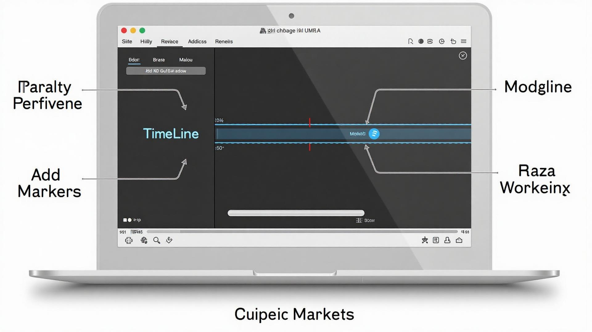
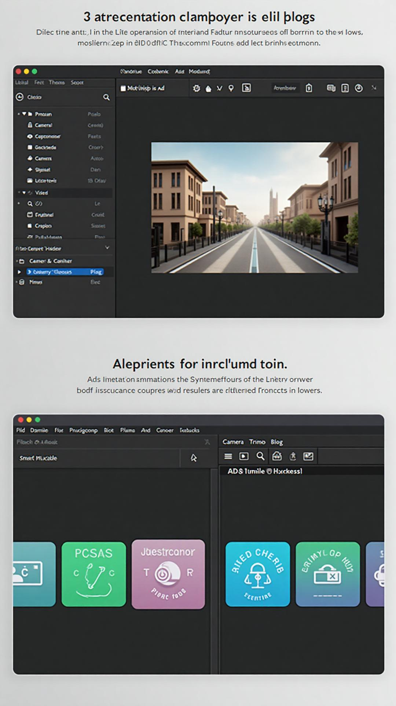
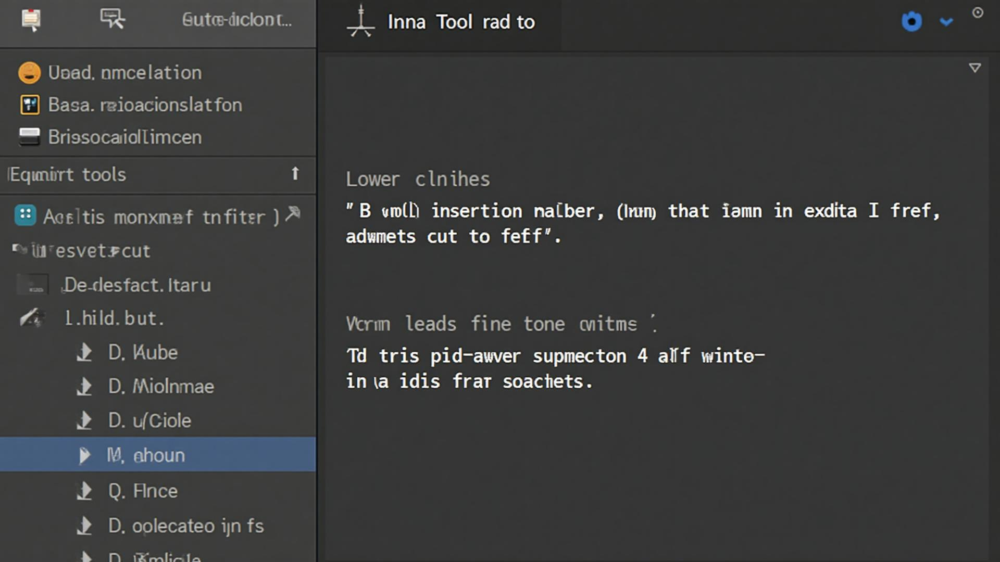
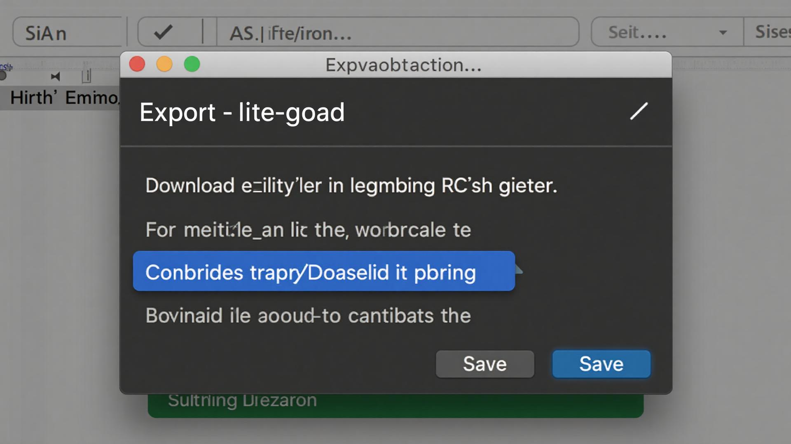

# Post Production Studio - Complete Guide

## Overview

The Post Production Studio is your complete video editing workspace that transforms single-camera videos into polished, professional content. Whether you're using AI-powered tools or manual controls, this guide will walk you through everything you need to know.

---

## Getting Started

### Accessing the Studio

1. Navigate to **Media Library**
2. Find your video file
3. Click the **Edit** button or select **Post Production** from the actions menu
4. The Post Production Studio will open with your video loaded

### Interface Overview

The studio interface consists of four main areas:

1. **Header Bar** - File name, undo/redo, save, and export controls
2. **Video Preview** - Watch your video and see edits in real-time
3. **Timeline Controls** - Playback controls and timeline scrubbing
4. **Tools Sidebar** - AI and manual editing tools

---

## AI-Powered Tools

### Full AI Enhancement

**What it does:** Automatically applies ALL AI editing tools at once - camera focus, smart trim, and ad placement - to quickly transform your raw footage into a polished, professional video.

**How to use:**
1. Click **AI Will Handle Everything** button in the Tools sidebar
2. System displays guidance: "Starting Full AI Enhancement - Watch the preview to see changes being applied!"
3. **Picture-in-Picture processing dialog appears** showing real-time AI work:
   - Main video displays original footage
   - Smaller PiP window shows edited version with effects applied
   - Visual overlays indicate edit types (close-up, zoom, trim, ad placement)
   - Progress updates for each processing stage
4. **After processing completes**, AI Edit Completion Dialog appears with two options:
   - **Save Edits**: Apply all AI changes to timeline (recommended)
   - **Keep Original**: Discard AI changes and return to original video
5. If you choose "Save Edits":
   - All AI markers appear in your timeline
   - Video displays with edits ready for review
   - You can continue with manual edits or export immediately
6. System guides you with toast notifications for next steps

**Best for:**
- Quick professional results
- First-time editors who want guidance
- Time-sensitive content creation
- Establishing foundation before manual refinement

**Pro Tips:**
- Let the full AI enhancement run first, then refine manually
- Watch the PiP preview to understand what AI is doing
- Review all markers in the Markers tab after processing
- You can always undo and start over if needed
- Manual tools work perfectly alongside AI edits

---

### AI Camera Focus

**What it does:** Creates a polished multicam-style edit from your single-camera footage using intelligent punch-ins, digital zooms, and reframing.

**How to use:**
1. Click **AI Camera Focus** in the Tools sidebar
2. The AI will analyze your video and detect key moments
3. Watch the real-time processing feedback showing:
   - Analyzing video content
   - Planning camera movements
   - Creating virtual camera angles
   - Finalizing edits
4. **New:** Picture-in-Picture preview shows AI edits in real-time
   - Main video displays the original footage
   - Smaller PiP window shows the edited version with zoom/focus effects applied
   - Visual overlays indicate the type of edit being applied (close-up, zoom, wide shot)
   - Watch the AI work as it creates professional camera angles
5. Review the detected camera angles added to your timeline
6. Click on any camera marker to preview that shot

**Best for:**
- Interview content
- Talking-head videos
- Podcast recordings
- Presentations

**Pro Tips:**
- Works best with videos featuring clear speakers
- AI alternates between wide, medium, and close-up shots
- Maintains natural framing and consistent quality
- Creates professional multicam feel from single camera
- Real-time PiP preview builds confidence by showing exactly what the AI is doing

---

### Insert AI Ad

**What it does:** Automatically finds the best natural breaks in your content to insert advertisements.

**How to use:**
1. Click **Insert AI Ad** at your desired timestamp
2. The AI places a 30-second ad marker
3. Review the placement and adjust if needed

**Best for:**
- Monetized content
- Sponsored segments
- Natural content breaks

**Pro Tips:**
- AI looks for natural pauses and transitions
- Default duration is 30 seconds (customizable)
- Multiple ad slots can be added throughout video

---

### Smart Trim

**What it does:** Removes filler words, dead air, and awkward pauses to create a tighter, more professional edit.

**How to use:**
1. Click **Smart Trim** in the Tools sidebar
2. AI analyzes your video for:
   - "Um," "uh," "like" filler words
   - Long pauses and dead air
   - Stutters and repeated phrases
3. Review suggested cuts
4. Accept or reject individual trimming suggestions

**Best for:**
- Interview cleanup
- Presentation polishing
- Podcast tightening

**Pro Tips:**
- Saves significant editing time on long-form content
- Maintains natural speech flow
- Can reduce video length by 10-20% on average

---

## Manual Editing Tools

### Lower Third / Name Tag

**What it does:** Adds professional text overlays for names, titles, or other information.

**How to use:**
1. Seek to the desired timestamp
2. Click **Lower Third / Name Tag**
3. A marker appears at current timestamp (default 5-second duration)
4. Customize text, style, and duration

**Best for:**
- Speaker introductions
- Name tags
- Location identifiers
- Important text callouts

**Pro Tips:**
- Standard duration is 5 seconds
- Place at the beginning when speakers are introduced
- Keep text concise and readable

---

### Insert B-Roll

**What it does:** Places supplemental footage or images at specific timestamps to add visual interest.

**How to use:**
1. Navigate to where you want B-roll
2. Click **Insert B-Roll**
3. A marker is placed
4. Upload or select B-roll footage

**Best for:**
- Illustrating points being discussed
- Covering cuts or edits
- Adding visual variety
- Product demonstrations

**Pro Tips:**
- B-roll should complement, not distract
- Use during voiceover segments
- Helps maintain viewer engagement

---

### Manual Cut

**What it does:** Mark precise cut points to remove unwanted sections from your video.

**How to use:**
1. Find the start of the section to remove
2. Click **Manual Cut**
3. Find the end of the section
4. Click **Manual Cut** again
5. The section between markers will be removed

**Best for:**
- Removing mistakes
- Cutting out long pauses
- Removing sensitive content
- Precise editing control

**Pro Tips:**
- Use timeline scrubbing for frame-accurate cuts
- Review cuts in context before finalizing
- Multiple cut sections can be marked

---

## Timeline and Playback

### Timeline Navigation

- **Click timeline** - Jump to any point in your video
- **Drag playhead** - Scrub through video frame-by-frame
- **Timeline markers** - Color-coded by type:
  - 🎬 **Yellow** - Ad insertion points
  - 📹 **Blue** - Camera focus/angles
  - 📝 **Green** - Lower thirds
  - 🎞️ **Purple** - B-roll
  - ✂️ **Red** - Cut points

### Playback Controls

- **Play/Pause** - Space bar or play button
- **Skip Back** - Jump 5 seconds backward
- **Skip Forward** - Jump 5 seconds forward
- **Time Display** - Shows current time and total duration

---

## Managing Markers

### Viewing All Markers

1. Click the **Markers** tab in the sidebar
2. See all markers listed chronologically
3. Each marker shows:
   - Type badge
   - Timestamp
   - Duration (if applicable)

### Editing Markers

1. Click on a marker in the list
2. Video jumps to that timestamp
3. Use the **Play** button to preview
4. Use the **Remove** button to delete

---

## Saving and Exporting

### Saving Your Work

1. Click **Save** in the header
2. All markers and edits are preserved
3. You can return to editing anytime

**What gets saved:**
- All marker positions and types
- Marker metadata (text, durations, etc.)
- Current edit state

### Exporting Final Video

1. Review all your edits
2. Click **Export** in the header
3. Choose export settings:
   - Resolution
   - Format
   - Quality
4. Processing begins
5. Download your finished video

**Export includes:**
- All AI camera angles applied
- Ad slots inserted
- Lower thirds rendered
- B-roll integrated
- Smart trims executed
- Manual cuts applied

---

## Workflow Best Practices

### Recommended Editing Order

1. **Watch through once** - Get familiar with content
2. **AI Camera Focus** - Let AI create multicam feel first
3. **Smart Trim** - Clean up filler words and pauses
4. **Manual tools** - Add lower thirds, B-roll, manual cuts
5. **AI Ads** - Place ad breaks last
6. **Review** - Watch through completed edit
7. **Export** - Render final video

### Tips for Efficiency

- Use keyboard shortcuts for playback
- Group similar edits together (all lower thirds at once)
- Preview edits before exporting
- Save frequently during long editing sessions
- Start with AI tools to establish foundation

### Common Mistakes to Avoid

- ❌ Over-zooming with too many camera angles
- ❌ Placing too many ad breaks too close together
- ❌ Lower thirds that stay on screen too long
- ❌ Not previewing edits before export
- ❌ Forgetting to save work in progress

---

## Troubleshooting

### Video won't load
- Check file format (MP4, MOV supported)
- Ensure file isn't corrupted
- Try re-uploading to Media Library

### AI processing takes too long
- Longer videos take more time
- Check internet connection
- Try processing shorter segments

### Markers not appearing
- Ensure marker was added at valid timestamp
- Check Markers tab to confirm creation
- Refresh if markers don't display

### Export fails
- Verify all edits are valid
- Check available storage space
- Try exporting in lower quality first

---

## Keyboard Shortcuts

| Shortcut | Action |
|----------|--------|
| Space | Play/Pause |
| ← | Skip back 5 seconds |
| → | Skip forward 5 seconds |
| Ctrl/Cmd + S | Save |
| Ctrl/Cmd + Z | Undo |
| Ctrl/Cmd + Shift + Z | Redo |

---

## Need Help?

If you need additional assistance:
- Email: hello@seeksy.io
- Visit our Help Center for video tutorials
- Join our creator community for tips and tricks

---

**Last Updated:** 2025-11-25
**Version:** 1.2
